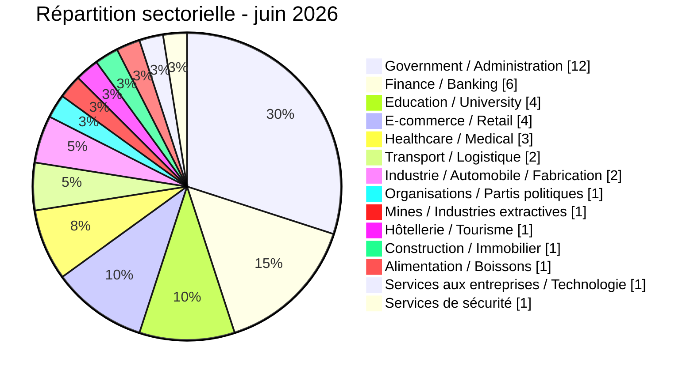

# Carte sectorielle AFRINTEL

## Exposition par secteur - juin 2026

| Secteur | Incidents | Part |
|---|---:|---:|
| Government / Administration | 12 | 30,0 % |
| Finance / Banking | 6 | 15,0 % |
| Education / University | 4 | 10,0 % |
| E-commerce / Retail | 4 | 10,0 % |
| Healthcare / Medical | 3 | 7,5 % |
| Transport / Logistique | 2 | 5,0 % |
| Industrie / Automobile / Fabrication | 2 | 5,0 % |
| Organisations / Partis politiques | 1 | 2,5 % |
| Mines / Industries extractives | 1 | 2,5 % |
| Hôtellerie / Tourisme | 1 | 2,5 % |
| Construction / Immobilier | 1 | 2,5 % |
| Alimentation / Boissons | 1 | 2,5 % |
| Services aux entreprises / Technologie | 1 | 2,5 % |
| Services de sécurité | 1 | 2,5 % |
| **Total** | **40** | **100 %** |

Government / Administration représente 12 fiches, suivi de Finance / Banking avec 6. Les 22 autres fiches sont réparties dans 12 secteurs explicites ; aucune catégorie sectorielle résiduelle n'est utilisée.
