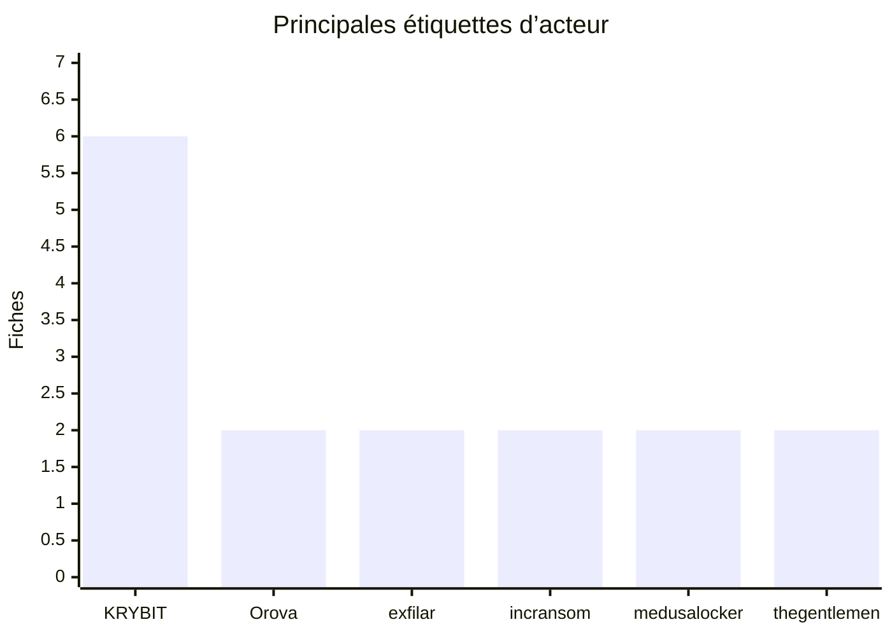

# Acteurs et sources de publication — août 2026

KRYBIT est associé à 6 fiches. Orova, exfilar, incransom, medusalocker et thegentlemen sont associés à 2 fiches chacun ; les 13 autres libellés apparaissent une fois. Une étiquette de publication ne constitue pas à elle seule une attribution confirmée.
