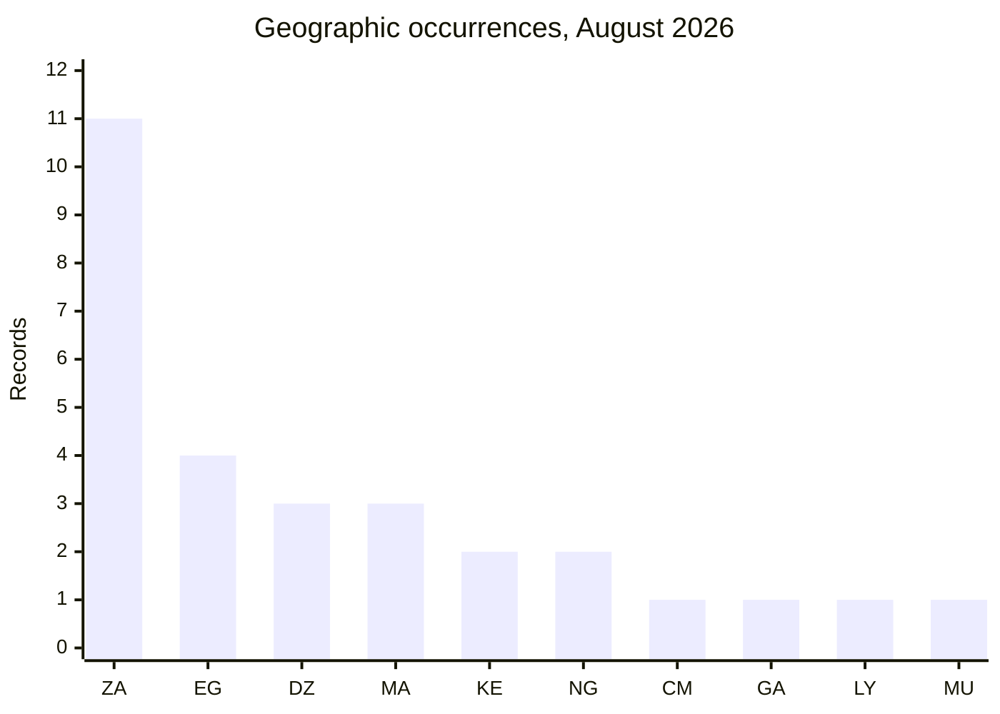

# Country hotspots — August 2026

| Country | Total | Ransomware | Data Leak | Access Sale |
|---|---:|---:|---:|---:|
| South Africa (ZA) | 11 | 9 | 2 | 0 |
| Egypt (EG) | 4 | 2 | 2 | 0 |
| Algeria (DZ) | 3 | 0 | 2 | 1 |
| Morocco (MA) | 3 | 1 | 2 | 0 |
| Kenya (KE) | 2 | 0 | 2 | 0 |
| Nigeria (NG) | 2 | 2 | 0 | 0 |
| Cameroon (CM) | 1 | 1 | 0 | 0 |
| Gabon (GA) | 1 | 1 | 0 | 0 |
| Libya (LY) | 1 | 0 | 1 | 0 |
| Mauritius (MU) | 1 | 1 | 0 | 0 |

Source: [August statistics](../../statistics/2026/08-august/README.md).
