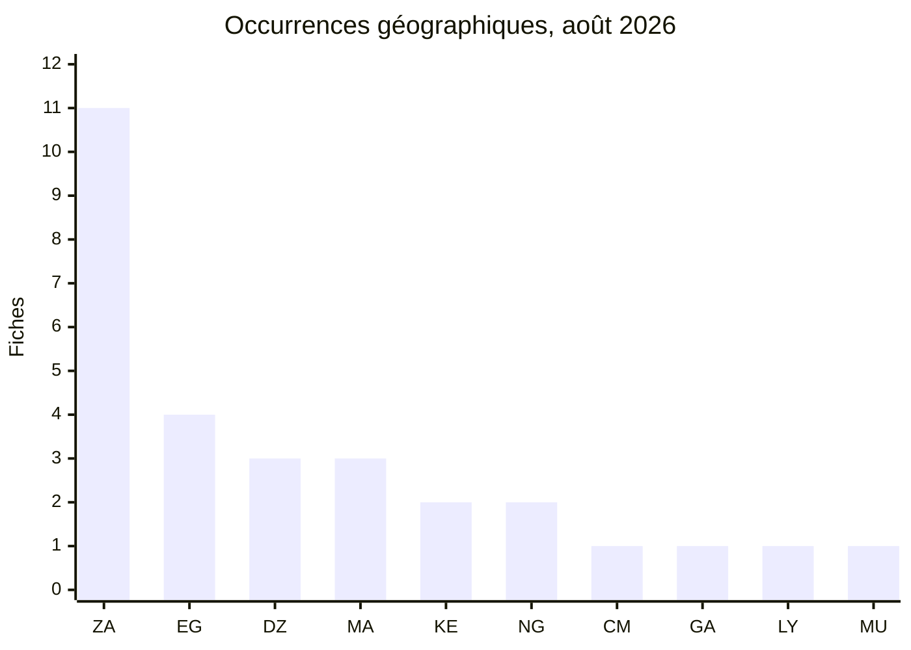

# Hotspots pays — août 2026

| Pays | Total | Ransomware | Data Leak | Access Sale |
|---|---:|---:|---:|---:|
| Afrique du Sud (ZA) | 11 | 9 | 2 | 0 |
| Égypte (EG) | 4 | 2 | 2 | 0 |
| Algérie (DZ) | 3 | 0 | 2 | 1 |
| Maroc (MA) | 3 | 1 | 2 | 0 |
| Kenya (KE) | 2 | 0 | 2 | 0 |
| Nigeria (NG) | 2 | 2 | 0 | 0 |
| Cameroun (CM) | 1 | 1 | 0 | 0 |
| Gabon (GA) | 1 | 1 | 0 | 0 |
| Libye (LY) | 1 | 0 | 1 | 0 |
| Maurice (MU) | 1 | 1 | 0 | 0 |

Source : [statistiques d’août](../../statistics/2026/08-august/README_FR.md).
