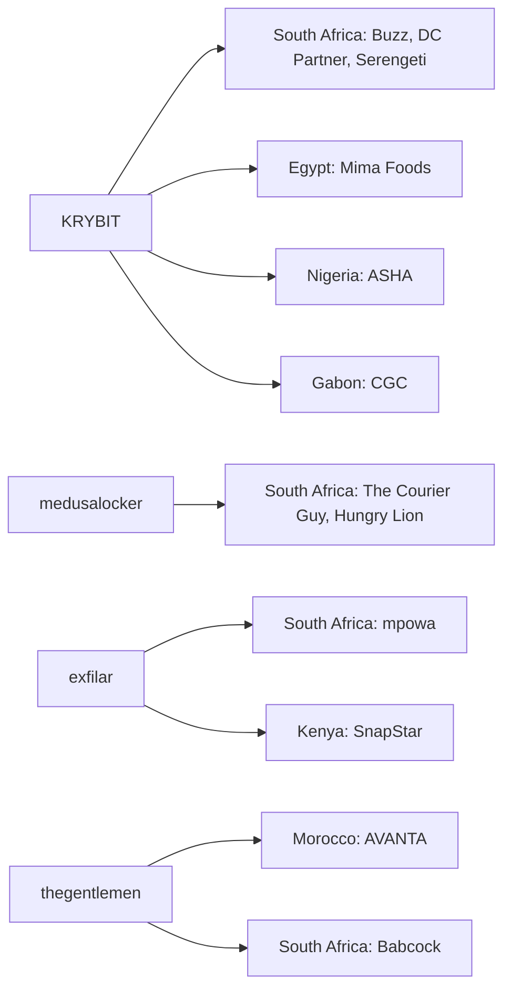

# Observed ecosystem — August 2026

```mermaid
flowchart LR
    K[KRYBIT] --> ZA[South Africa: Buzz, DC Partner, Serengeti]
    K --> EG[Egypt: Mima Foods]
    K --> NG[Nigeria: ASHA]
    K --> GA[Gabon: CGC]
    M[medusalocker] --> Z2[South Africa: The Courier Guy, Hungry Lion]
    E[exfilar] --> Z3[South Africa: mpowa]
    E --> KE[Kenya: SnapStar]
    T[thegentlemen] --> MA[Morocco: AVANTA]
    T --> Z4[South Africa: Babcock]
```

The graph only links publication associations present in the cards. It does not infer an intrusion chain or an operational relationship between actors.
