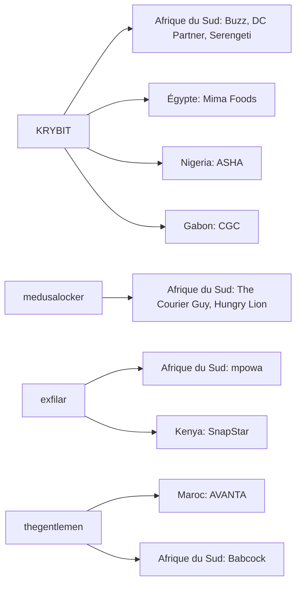

# Écosystème observé — août 2026

```mermaid
flowchart LR
    K[KRYBIT] --> ZA[Afrique du Sud: Buzz, DC Partner, Serengeti]
    K --> EG[Égypte: Mima Foods]
    K --> NG[Nigeria: ASHA]
    K --> GA[Gabon: CGC]
    M[medusalocker] --> Z2[Afrique du Sud: The Courier Guy, Hungry Lion]
    E[exfilar] --> Z3[Afrique du Sud: mpowa]
    E --> KE[Kenya: SnapStar]
    T[thegentlemen] --> MA[Maroc: AVANTA]
    T --> Z4[Afrique du Sud: Babcock]
```

Le graphe relie uniquement des associations de publication présentes dans les fiches. Il ne déduit ni chaîne d’intrusion ni relation opérationnelle entre acteurs.
