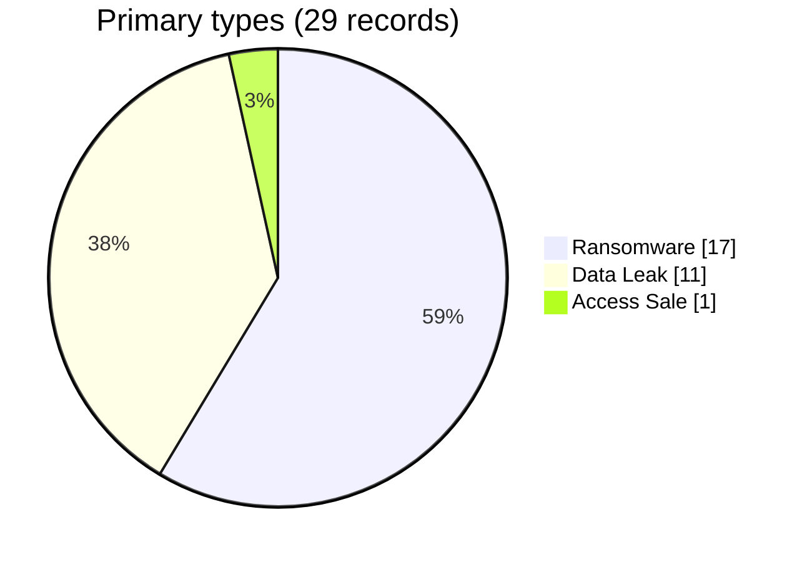

# Ransomware, leaks and access — August 2026

A ransomware listing, a sample, a deadline and a disclosure are distinct events. The 17 records are assigned to the August corpus from dated observations; the compromise date is not established for every case.
