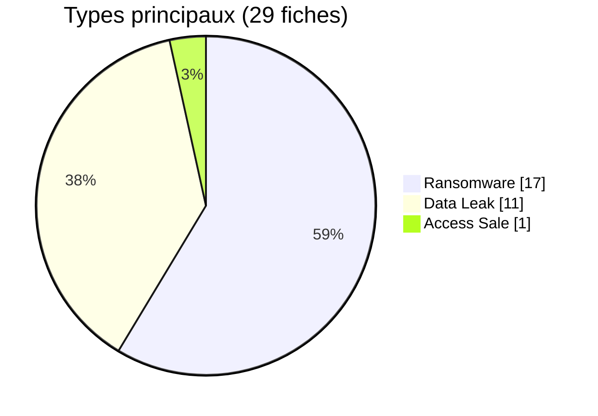

# Ransomware, fuites et accès — août 2026

La publication d’une fiche ransomware, un échantillon, une échéance et une divulgation sont des événements distincts. Les 17 fiches sont rattachées au corpus d’août selon des observations datées ; la date de compromission n’est pas établie pour chaque cas.
