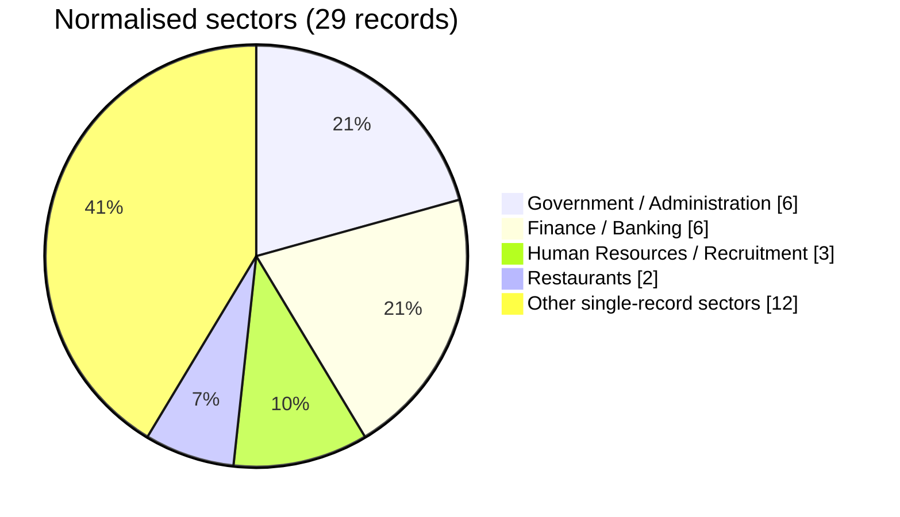

# Sector map — August 2026

The 12 other sectors are E-commerce, Engineering, Food manufacturing, Healthcare, Labour relations, Media, Plastics, Real Estate, Sports, Telecommunications, Transport and Travel (one each).

Source: [August statistics](../../statistics/2026/08-august/README.md).
