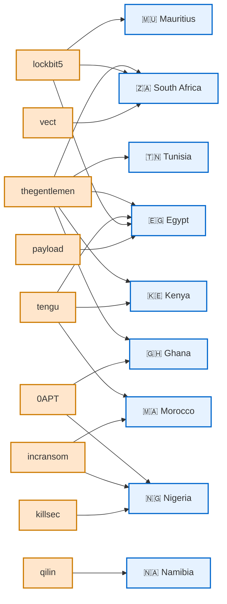
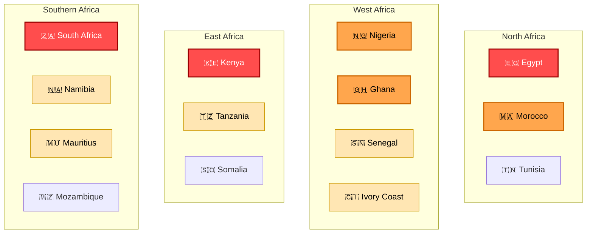

# AFRINTEL - Visual threat intelligence graphs
👉🏾 [**French version available here** ](README_FR.md)
These graphs are designed for integration into AFRINTEL reports or statistical dashboards.

---

# 📊 Threat actors vs targeted countries

This graph shows which **ransomware groups or threat actors targeted specific African countries**.

---

# 🌍 Stylized cyber threat map of Africa

This diagram represents **regional cyber threat pressure across Africa**.

---

# Interpretation

**High threat pressure regions**
- South Africa
- Egypt
- Kenya

**Medium pressure**
- Nigeria
- Ghana
- Morocco

**Lower but emerging threat zones**
- Tanzania
- Senegal
- Namibia
- Mauritius

---

AFRINTEL - African Threat Intelligence Initiative
