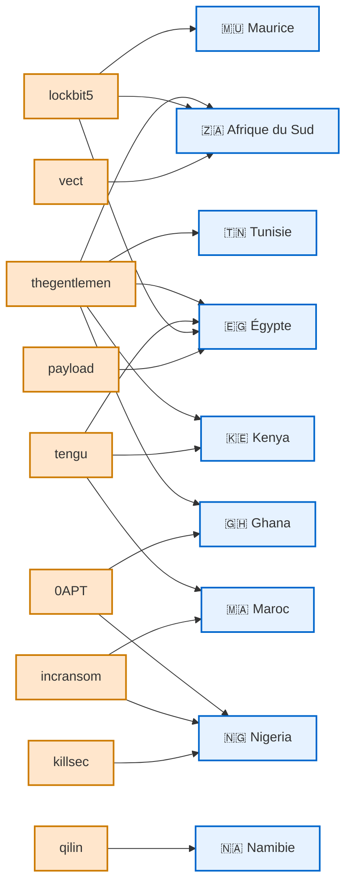
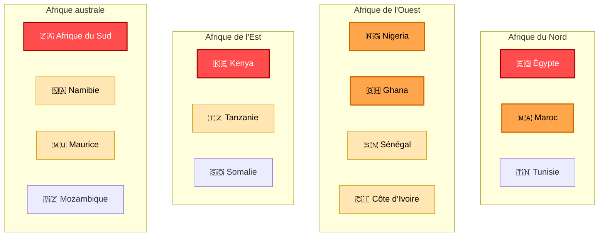

# AFRINTEL - Graphes de renseignement sur les cybermenaces

👉🏾 [Version anglaise disponible ici](README.md)

Ces graphes sont conçus pour être intégrés dans les **rapports AFRINTEL** ou dans des **tableaux de bord statistiques CTI**.

---

# 📊 Acteurs de menace vs pays ciblés

Ce graphe montre quels **groupes ransomware ou acteurs de menace ont ciblé certains pays africains**.

---

# 🌍 Carte stylisée des cybermenaces en Afrique

Ce diagramme représente **la pression des cybermenaces par région sur le continent africain**.

---

# Interprétation

**Régions avec forte pression cyber :**
- Afrique du Sud
- Égypte
- Kenya

**Pression intermédiaire :**
- Nigeria
- Ghana
- Maroc

**Zones de menace émergente :**
- Tanzanie
- Sénégal
- Namibie
- Maurice

---

AFRINTEL — Initiative africaine de Cyber Threat Intelligence
