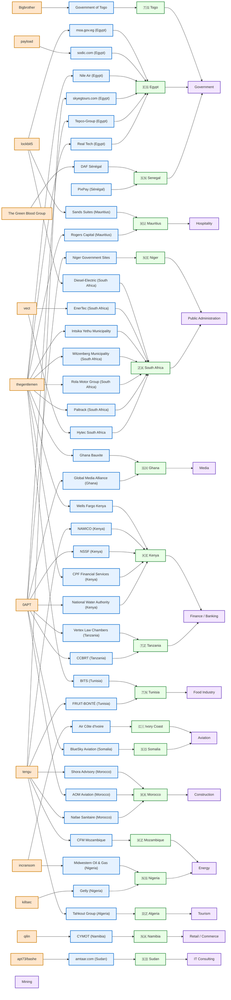

## 🔗 Threat actor mapping

This graph shows the connections between ransomware groups and their targets across Africa.

```mermaid
flowchart LR

%% ===== STYLES =====
classDef actor fill:#ffe6cc,stroke:#cc7a00,stroke-width:2px;
classDef victim fill:#e6f2ff,stroke:#0066cc,stroke-width:2px;
classDef country fill:#e8ffe6,stroke:#2b8a3e,stroke-width:2px;
classDef sector fill:#f3e6ff,stroke:#6f42c1,stroke-width:2px;

%% ===== ACTEURS/ACTORS (TOUS LES 12) =====
A1["The Green Blood Group"]:::actor
A2["0APT"]:::actor
A3["thegentlemen"]:::actor
A4["lockbit5"]:::actor
A5["incransom"]:::actor
A6["qilin"]:::actor
A7["vect"]:::actor
A8["payload"]:::actor
A9["apt73/bashe"]:::actor
A10["tengu"]:::actor
A11["killsec"]:::actor
A12["Bigbrother"]:::actor

%% ===== VICTIMES/VICTIMS (21 de janvier + 20 de février) =====
%% Janvier/January
V1["PixPay (Sénégal)"]:::victim
V2["Government of Togo"]:::victim
V3["Niger Government Sites"]:::victim
V4["Hytec South Africa"]:::victim
V5["National Water Authority (Kenya)"]:::victim
V6["Real Tech (Egypt)"]:::victim
V7["Tepco-Group (Egypt)"]:::victim
V8["Rogers Capital (Mauritius)"]:::victim
V9["CFM Mozambique"]:::victim
V10["CCBRT (Tanzania)"]:::victim
V11["Nafae Sanitaire (Morocco)"]:::victim
V12["CPF Financial Services (Kenya)"]:::victim
V13["NSSF (Kenya)"]:::victim
V14["Paltrack (South Africa)"]:::victim
V15["Rola Motor Group (South Africa)"]:::victim
V16["Witzenberg Municipality (South Africa)"]:::victim
V17["NAMICO (Kenya)"]:::victim
V18["FRUIT-BONTÉ (Tunisia)"]:::victim
V19["skyegtours.com (Egypt)"]:::victim
V20["Tahkout Group (Algeria)"]:::victim
V21["AOM Aviation (Morocco)"]:::victim

%% Février/February 
V22["DAF Sénégal"]:::victim
V23["BlueSky Aviation (Somalia)"]:::victim
V24["Global Media Alliance (Ghana)"]:::victim
V25["Vertex Law Chambers (Tanzania)"]:::victim
V26["Wells Fargo Kenya"]:::victim
V27["Getly (Nigeria)"]:::victim
V28["Ghana Bauxite"]:::victim
V29["Midwestern Oil & Gas (Nigeria)"]:::victim
V30["Nile Air (Egypt)"]:::victim
V31["Sands Suites (Mauritius)"]:::victim
V32["Intsika Yethu Municipality"]:::victim
V33["BITS (Tunisia)"]:::victim
V34["sodic.com (Egypt)"]:::victim
V35["amtaar.com (Sudan)"]:::victim
V36["Air Côte d'Ivoire"]:::victim
V37["Shora Advisory (Morocco)"]:::victim
V38["moa.gov.eg (Egypt)"]:::victim
V39["CYMOT (Namibia)"]:::victim
V40["EnerTec (South Africa)"]:::victim
V41["Diesel-Electric (South Africa)"]:::victim

%% ===== PAYS =====
C1["🇸🇳 Senegal"]:::country
C2["🇸🇴 Somalia"]:::country
C3["🇬🇭 Ghana"]:::country
C4["🇹🇿 Tanzania"]:::country
C5["🇰🇪 Kenya"]:::country
C6["🇪🇬 Egypt"]:::country
C7["🇿🇦 South Africa"]:::country
C8["🇲🇺 Mauritius"]:::country
C9["🇨🇮 Ivory Coast"]:::country
C10["🇳🇬 Nigeria"]:::country
C11["🇲🇦 Morocco"]:::country
C12["🇹🇳 Tunisia"]:::country
C13["🇩🇿 Algeria"]:::country
C14["🇲🇿 Mozambique"]:::country
C15["🇳🇦 Namibia"]:::country
C16["🇸🇩 Sudan"]:::country
C17["🇹🇬 Togo"]:::country
C18["🇳🇪 Niger"]:::country

%% ===== SECTEURS/SECTORS =====
S1["Government"]:::sector
S2["Aviation"]:::sector
S3["Energy"]:::sector
S4["Finance / Banking"]:::sector
S5["Media"]:::sector
S6["Hospitality"]:::sector
S7["Public Administration"]:::sector
S8["Retail / Commerce"]:::sector
S9["IT Consulting"]:::sector
S10["Construction"]:::sector
S11["Tourism"]:::sector
S12["Mining"]:::sector
S13["Food Industry"]:::sector

%% ===== RELATIONS ACTEURS → VICTIMES (janvier) =====
A12 --> V2
A2 --> V3
A7 --> V4
A2 --> V5
A3 --> V6
A2 --> V7
A3 --> V8
A10 --> V9
A2 --> V10
A10 --> V11
A3 --> V12
A2 --> V13
A3 --> V14
A3 --> V15
A3 --> V16
A10 --> V17
A10 --> V18
A10 --> V19
A10 --> V20
A2 --> V21

%% ===== RELATIONS ACTEURS → VICTIMES (février) =====
A1 --> V22
A2 --> V23
A2 --> V24
A2 --> V25
A3 --> V26
A11 --> V27
A3 --> V28
A5 --> V29
A3 --> V30
A4 --> V31
A3 --> V32
A3 --> V33
A8 --> V34
A9 --> V35
A5 --> V36
A10 --> V37
A4 --> V38
A6 --> V39
A7 --> V40
A4 --> V41

%% ===== RELATIONS VICTIMES → PAYS =====
V1 --> C1
V2 --> C17
V3 --> C18
V4 --> C7
V5 --> C5
V6 --> C6
V7 --> C6
V8 --> C8
V9 --> C14
V10 --> C4
V11 --> C11
V12 --> C5
V13 --> C5
V14 --> C7
V15 --> C7
V16 --> C7
V17 --> C5
V18 --> C12
V19 --> C6
V20 --> C13
V21 --> C11
V22 --> C1
V23 --> C2
V24 --> C3
V25 --> C4
V26 --> C5
V27 --> C10
V28 --> C3
V29 --> C10
V30 --> C6
V31 --> C8
V32 --> C7
V33 --> C12
V34 --> C6
V35 --> C16
V36 --> C9
V37 --> C11
V38 --> C6
V39 --> C15
V40 --> C7
V41 --> C7

%% ===== RELATIONS PAYS → SECTEURS =====
C1 --> S1
C2 --> S2
C3 --> S5
C4 --> S4
C5 --> S4
C6 --> S1
C7 --> S7
C8 --> S6
C9 --> S2
C10 --> S3
C11 --> S10
C12 --> S13
C13 --> S11
C14 --> S3
C15 --> S8
C16 --> S9
C17 --> S1
C18 --> S7
```
