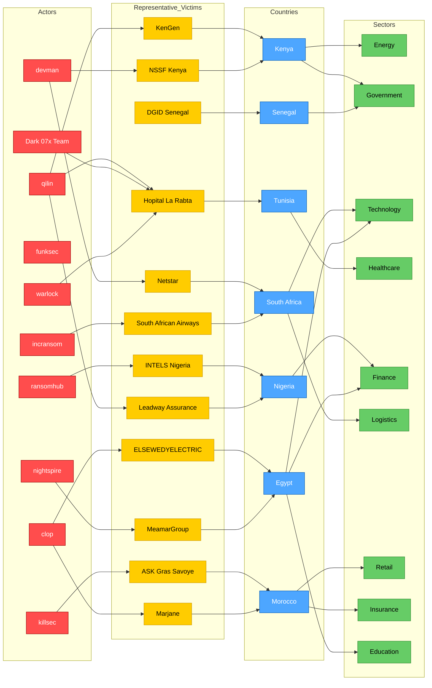

# AFRINTEL 2025 — CTI Ecosystem Map

This visualization provides a **readable strategic map** of the 2025 AFRINTEL dataset by focusing on:
- the **most active threat actors**
- the **most targeted countries**
- the **most exposed sectors**
- a limited set of **representative victims**

For the full 2025 dataset, this map should be read together with the yearly statistics and the dedicated double-claims graph.

## 1. Strategic ecosystem view

## 2. Reading guide

- **Red nodes**: threat actors / ransomware groups / malicious actors
- **Yellow nodes**: representative victims
- **Blue nodes**: countries
- **Green nodes**: sectors

## 3. Analytical notes

- The 2025 African threat landscape is dominated by **Egypt, South Africa, and Morocco**.
- **qilin**, **devman**, and **incransom** are among the most visible actors in the yearly dataset.
- High-pressure sectors include **technology**, **public administration**, **finance**, **education**, and **healthcare**.
- This map is intentionally **condensed for readability** and does not attempt to display all 149 victim entries in one Mermaid diagram.
