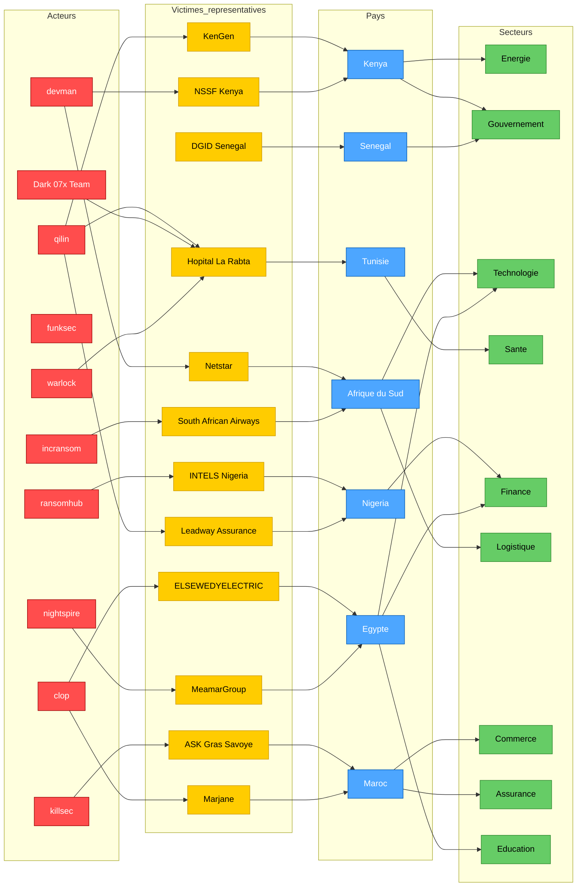

# AFRINTEL 2025 - Carte de l’écosystème CTI
👉🏾 [**English version available here**](./ecosystem-map_2025.md)

Cette visualisation propose une **vue stratégique lisible** du dataset AFRINTEL 2025 en se concentrant sur :
- les **acteurs les plus actifs**
- les **pays les plus ciblés**
- les **secteurs les plus exposés**
- un sous-ensemble de **victimes représentatives**

Pour la couverture complète 2025, cette carte doit être lue avec les statistiques annuelles et le graphe dédié aux doubles revendications.

## 1. Vue stratégique de l’écosystème

## 2. Guide de lecture

- **Rouge** : acteurs / groupes ransomware / acteurs malveillants
- **Jaune** : victimes representatives
- **Bleu** : pays
- **Vert** : secteurs

## 3. Notes d’analyse

- Le paysage 2025 est domine par **l’Egypte, l’Afrique du Sud et le Maroc**.
- **qilin**, **devman** et **incransom** figurent parmi les acteurs les plus visibles du dataset annuel.
- Les secteurs a plus forte pression incluent **technologies**, **administrations publiques**, **finance**, **education** et **sante**.
- Cette carte est volontairement **condensee pour rester lisible** et n’affiche donc pas les 149 entrees du dataset dans un seul diagramme Mermaid.
